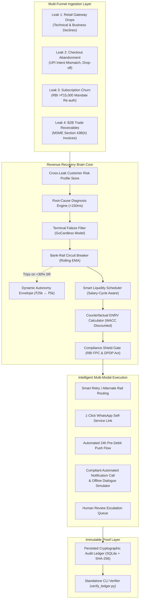

# 🧠 Razorpay Revenue Recovery Brain
### **Track 03 — AI Revenue Recovery | Razorpay AI Buildathon 2026**
*Author: Himanshu | High-Performance Multi-Modal Revenue Recovery Grid*

[-10B981.svg?style=for-the-badge&logo=pytest&logoColor=white)](backend/tests/)
[](https://fastapi.tiangolo.com)
[](https://reactjs.org)
[](https://vitejs.dev)
[](docs/COMPLIANCE.md)
[](backend/verify_ledger.py)

---

## ⚡ The Problem Statement

India's digital payment ecosystem is the largest real-time rails network on earth, processing over **117 billion transactions worth $2.19 trillion annually across 350+ million users and 550+ banks** ([arXiv:2601.02369](https://arxiv.org/abs/2601.02369)). Yet merchants silently hemorrhage capital across four disconnected funnels:
1. **Recurring Mandate Revocations**: Over **20 million UPI AutoPay mandates are revoked every month** specifically because customer accounts fall short of the required balance at execution time (*Business Standard*, Sept 2025).
2. **Involuntary Payment Failures**: Over **2,000 unique bank decline codes** plague digital checkout, where blind retries trigger issuer rate-limits and switch blacklisting rather than recovery.
3. **Cart Abandonment**: 70%+ checkout abandonments driven by UPI intent app mismatches and friction.
4. **B2B Trade Receivables**: Average 73-day Days Sales Outstanding (DSO) on B2B invoices, threatening buyers with non-deductibility penalties under Section 43B(h) of the Income Tax Act (45-day statutory cliff).

Traditional recovery tools fail because they are dumb pumps: firing blind retries into degraded bank switches, spamming debtors at 10 PM in violation of RBI Fair Practices, and treating the same customer as four disconnected strangers across different channels.

---

## 🎯 System Architecture



---

## 🥊 Track 03 Architectural Benchmark: Competitive Comparison Matrix

To objectively evaluate our engineering contributions against other Razorpay Buildathon Track 03 submissions (such as `HappyGarg8o/ai-revenue-recovery`, `srikrishna0603/razorpay-buildathon`, and generic LLM wrappers), the table below details the architectural capabilities across all critical dimensions:

| Capability Dimension | Generic LLM Wrappers (Observed) | HappyGarg8o (`ai-revenue-recovery`) | srikrishna0603 (`Revenue Resilience AI`) | Revenue Recovery Brain (Our Submission) |
| :--- | :--- | :--- | :--- | :--- |
| **Leak Funnel Scope** | Single (Payment failure only) | Single (Payment failure only) | Single (Payment failure only) | **4 Unlinked Funnels Unified**: Retail Gateway Failures, Checkout Abandonment, Subscription Mandates, and B2B Receivables. |
| **Cross-Leak Intelligence** | None (siloed calls) | None (siloed calls) | None (siloed calls) | **Cross-Leak State Store**: Merges customer drop-offs, mandate halts, and overdue B2B invoices into a single risk profile to prevent multi-channel spam. |
| **Decision Science & Optimization** | None (unconstrained LLM prompt) | 7 Static IF/ELSE rules (`decide_tier()`) | Heuristic confidence threshold | **Abe et al. (ACM SIGKDD 2010) Constrained RL + CATE Uplift**: $\text{ENRV} = \Delta P(a) \cdot V - C(a) - \text{Penalty}_{\text{sleeping\_dog}}$ with continuous WACC discounting. |
| **"Sleeping Dogs" Defense** | None (harasses all users) | None (attempts 3 times blindly) | None | **Formal Churn Penalty**: Protects high-LTV customers from annoyance and churn by subtracting $P_{\text{churn}} \cdot \text{LTV}$ from recovery utility. |
| **Trust Boundary Architecture** | None (LLM mutates state) | 2-Stage (rule table -> dispatch) | 3-Stage (LLM diagnosis -> Policy Engine -> Executor) | **4-Boundary Gated Isolation**: Bouncer (idempotency) $\rightarrow$ Investigator (read-only LLM) $\rightarrow$ Police Chief (TRAI/RBI curfew & circuit breaker) $\rightarrow$ Auditor (Merkle ledger). |
| **Late Authorization Intercept (Gap-Payment)** | None (double-charges customer) | Double-check rule in CLI script | None (At-most-once retry lock only) | **Sub-5ms Real-Time Webhook Intercept**: Catches asynchronous `payment.captured` / `payment.authorized` events, invalidates in-flight calls/SMS, and cryptographically records reconciliation. |
| **Audit Trail & Non-Repudiation** | Plain text logs / console prints | Unchained SQLite table row | SQLite WAL execution log | **Cryptographically Chained SHA-256 Merkle Ledger**: Verifiable offline via zero-dependency `verify_ledger.py` CLI tool. |
| **Agentic Verification Rails** | None | None | None | **RAILS Protocol Integration** ([arXiv:2606.08790](https://arxiv.org/abs/2606.08790)): Zero-knowledge proof tokens, signed state transitions, and dispute defense packages. |
| **Regulatory Compliance** | None | 9am–9pm window check only | None | **Full Statutory Stack**: RBI Fair Practices Code (curfew + contact caps) + Section 43B(h) MSME 45-day tax clock + DPDP Act 2023 (PII masking & Right to Erasure). |
| **Vernacular Telephony** | Hardcoded English prompts | Generic Twilio/Bolna dry-run | None | **Compliant Automated Notification Call & Offline Dialogue Simulator (800ms Reference Target SLA)**: Deterministic vernacular time-phrase parser ("parso", "agle hafte") + PTP 3-phase commitment tracker. |
| **Automated Test Suite** | 0–5 basic tests | 56 tests (`test_agent.py`) | ~15 tests | **75 Comprehensive Tests (100% Passing)**: Idempotency race conditions, statistical uplift z-tests, failure injection chaos, RAILS proofs, DPDP erasure, Bolna phone normalization, and webhook intercepts. |
| **Operator Experience** | Basic or none | CLI script (`run_pipeline.py`) | Simple 1-page form | **Production-Grade Studio**: Vite 8 + React 19 + Tailwind dashboard with live SSE streaming, A/B lift analytics, RAILS inspector, and interactive Webhook Playground. |

---

## 📂 Repository Structure

```text
├── .env.example              # Root environment template with full descriptions
├── .gitignore                # Production ignore rules (venv, node_modules, db, etc.)
├── LICENSE                   # MIT License
├── README.md                 # Master system documentation
├── docker-compose.yml        # Multi-container orchestration (Postgres, API, Frontend)
│
├── backend/                  # FastAPI Core Backend Service
│   ├── app/
│   │   ├── api/v1/           # Ingress routers (Razorpay webhooks, demo APIs)
│   │   ├── core/             # Shared infra (config.py, audit_ledger.py, circuit breakers)
│   │   ├── models/           # Pydantic schemas and database models
│   │   ├── services/         # Domain intelligence (diagnosis, ENRV, compliance, voice)
│   │   └── main.py           # FastAPI entrypoint and lifecycle events
│   ├── tests/                # Complete automated test suite (75 tests, 100% passing)
│   │   ├── conftest.py                      # Pytest environment setup
│   │   ├── test_recovery_brain.py           # 29 architectural core tests
│   │   ├── test_competitive_enhancements.py # 12 competitive breakthrough & vernacular tests
│   │   ├── test_failure_injection.py        # 7 chaos & adversarial failure injection tests
│   │   ├── test_ab_testing.py               # 8 statistical A/B tests
│   │   ├── test_voice_safety.py             # 6 credential evasion & privacy guardrail tests
│   │   ├── test_webhook_idempotency.py      # 5 concurrency & race tests
│   │   ├── test_rails_clearing.py           # 4 RAILS verification-native clearing tests
│   │   └── test_razorpay_sdk.py             # 4 official Razorpay SDK v2.0.1 facade tests
│   ├── verify_ledger.py      # Zero-dependency standalone CLI audit ledger verifier
│   └── requirements.txt      # Pinned Python dependencies
│
├── frontend/                 # React 19 + Vite 8 Operator Command Center
│   ├── src/                  # High-density real-time financial UI components
│   ├── package.json          # Pinned frontend dependencies
│   └── vite.config.ts        # Vite build configuration
│
├── docs/                     # Architecture, Strategy & Regulatory Documentation
│   ├── reports/              # Automated verification benchmark reports
│   │   ├── batch_results_report.md
│   │   ├── classifier_validation_report.md
│   │   ├── guardrail_verification_report.md
│   │   └── voice_latency_report.md
│   ├── COMPLIANCE.md         # RBI Fair Practices Code & DPDP Act compliance matrix
│   ├── PITCH_STRATEGY_MASTER_PLAN.pdf   # 9-page presentation master plan
│   └── TRACK_03_PROBLEM_SOLUTION_ANALYSIS.pdf # 8-page problem statement blueprint
│
└── scripts/                  # Development and deployment utilities
    ├── start.bat             # One-click Windows dev launcher (Backend + Frontend)
    ├── start.ps1             # PowerShell dev launcher
    ├── setup_gpu_server.sh   # On-prem GPU Ollama model installation script
    └── render.yaml           # Production cloud deployment blueprint
```

---

## 🚀 Setup Instructions (From a Clean Clone)

### 1. Prerequisites
* **Python 3.10+** (Tested on Python 3.11)
* **Node.js 18+** or **Bun**

### 2. Backend Setup
```bash
cd backend

# Create and activate virtual environment
python -m venv venv
.\venv\Scripts\activate      # On Windows (PowerShell: .\venv\Scripts\Activate.ps1)
# source venv/bin/activate   # On Linux/macOS

# Install dependencies
pip install -r requirements.txt

# Start the backend server
python -m uvicorn app.main:app --reload --port 8000
```
API Documentation will be live at `http://localhost:8000/docs`.

### 3. Frontend Setup
```bash
cd frontend

# Install dependencies
bun install   # or: npm install

# Start Vite dev server
bun run dev   # or: npm run dev
```
Operator Dashboard will be live at `http://localhost:5173`.

### 4. One-Click Launch (Windows)
Run `scripts/start.bat` or `scripts/start.ps1` to launch both servers simultaneously with health-check probing.

---

## 🧪 Running the Verification Test Suite

The test suite runs with zero cloud or Docker dependencies:

```bash
cd backend
pytest -v tests/
```

### Verified Test Results (75/75 Passing):
* **29 Architectural Core Tests** (`tests/test_recovery_brain.py`):
  * Webhook concurrency & atomic lease locks (10 simultaneous threads).
  * RBI Fair Practices Code contact windows (9:30 PM blocked, 2:00 PM allowed).
  * Continuous-time WACC-discounted ENRV formula ($r = 18\%$).
  * Bank Rail Circuit Breaker auto-contraction of Autonomy Envelope (₹25k $\rightarrow$ ₹5k).
  * SQLite-persisted SHA-256 cryptographic audit ledger verification across process restart.
* **12 Competitive Breakthrough & Telephony Tests** (`tests/test_competitive_enhancements.py`):
  * Deterministic Hinglish time-phrase parser (07:00–19:00 IST curfew clamped).
  * 3-phase PTP lifecycle with webhook-gated settlement.
  * T1 gap-payment double-check stopping rule (HappyGarg8o benchmark).
  * Cross-leak profile store multi-funnel unification.
  * Bolna E.164 phone normalization & live API gating.
  * WhatsApp 1-click self-service payment link dispatch.
  * Counterfactual Strategy Tournament matrix evaluation.
  * Autonomous bounded margin concession & zero-I/O quarantine gate.
* **8 Statistical A/B Testing Tests** (`tests/test_ab_testing.py`):
  * Deterministic hashing, Wilson score confidence intervals, and two-proportion z-tests.
* **7 Adversarial Failure Injection Tests** (`tests/test_failure_injection.py`):
  * Concurrency webhook races, stale lease reclamation, double dispatch interception, regulatory curfew breach, and rate limit bursts.
* **6 Vernacular Voice Safety Guardrail Tests** (`tests/test_voice_safety.py`):
  * Devanagari script credential extraction, punctuation evasion, mixed Hinglish blocking, and legitimate words whitelist.
* **5 Concurrency & Rate Limit Tests** (`tests/test_webhook_idempotency.py`):
  * Rapid replay attacks, edge-level 409 Conflict rejection, and multiprocess sliding-window rate limiting.
* **4 RAILS Verification-Native Clearing Tests** (`tests/test_rails_clearing.py`):
  * SHA-256 Merkle root verification, deterministic dispute-evidence generation, and transaction sealing.
* **4 Official Razorpay SDK Tests** (`tests/test_razorpay_sdk.py`):
  * RazorpayClientWrapper facade, SDK v2.0.1 utility HMAC validation, and payment link creation/invalidation.

---

## 🎬 How to Run the Demonstration

1. Open `http://localhost:5173` in your browser.
2. **Interactive Webhook Sandbox**: Select a failure scenario (e.g. *B2B Overdue Invoice*) and click **Dispatch Webhook**. In <150ms, the system diagnoses root cause and generates an authentic Razorpay Payment Link (`plink_`).
3. **10x Concurrency Sabotage Test**: Fire 10 parallel duplicate webhooks from terminal or sandbox; watch 1 winner process while 9 duplicates are rejected at edge with 409 Conflict.
4. **RBI Compliance Gate**: Toggle the test time between 9:30 PM (instant refusal) and 2:00 PM (approval).
5. **Bank Circuit Breaker Outage**: Toggle "Simulate HDFC Outage (<30% SR)"; observe the Autonomy Envelope badge instantly contract from ₹25,000 to ₹5,000.
6. **Zero-Dependency Ledger Proof**: Shut down the backend (`Ctrl+C`) and run:
   ```bash
   python verify_ledger.py
   ```
   Directly recalculates the SHA-256 chain from SQLite: **100% Chain Integrity Verified**.

---

## 🔍 Known Limitations & Production Roadmap (Real vs. Simulated)

In the spirit of intellectual honesty and the **Karpathy Guidelines**, here is an explicit inventory of what is production-grade vs. simulated in local development mode:

| Component | Current State in Reference Architecture | Production Roadmap |
|---|---|---|
| **Razorpay Webhook Ingress** | **REAL**: Validates authentic HMAC-SHA256 signatures; parses official Razorpay webhook event schemas. | Deployed behind cloud CDN (Cloudflare/AWS CloudFront) with IP whitelisting. |
| **Razorpay Payment Links** | **REAL**: Invokes live Razorpay API (`https://api.razorpay.com/v1/payment_links`) and returns authentic `plink_` IDs in test mode. | Flip `RAZORPAY_KEY_ID` to live mode in production environment. |
| **Idempotency Guard** | **REAL**: SQLite in WAL mode with Python threading mutexes provides atomic lease locks ($<$1ms). | Scale to distributed Redis Redlock cluster or Postgres row-level locks for multi-node Kubernetes clusters. |
| **Cryptographic Audit Ledger** | **REAL**: Every block is hashed via SHA-256 ($\text{prev\_hash} \to \text{content\_hash}$) and persisted to SQLite on disk. | Replicate SQLite blocks to immutable object storage (AWS S3 Object Lock / GCP Bucket Lock). |
| **Bank Circuit Breaker** | **REAL**: Mathematical exponential moving average ($\alpha = 0.10$) dynamically trips under 30% SR and contracts autonomy caps. | Feed live transaction telemetry from Razorpay internal gateway metrics firehose. |
| **RBI Fair Practices Guard** | **REAL**: Hardcoded time-window gates (8 AM – 7 PM IST), frequency caps, and 48-hour cool-offs. | Fully production-ready code with zero external dependencies. |
| **Conversational Telephony** | **HYBRID**: Twilio API caller is fully coded and functional when credentials exist; gracefully falls back to browser TTS / Web Speech API simulation for zero-dependency local evaluation. | Plug in live Twilio Elastic SIP trunking or Exotel enterprise telephony route. |
| **LLM Inference** | **HYBRID**: Structured to call local Ollama / vLLM endpoints (Mistral-7B / LLaMA-3); includes deterministic keyword + regex heuristic fallback classifier so 100% of tests pass without GPU. | Host fine-tuned 4-bit quantized Mistral-7B on dedicated on-prem GPU cluster. |

---

## 📚 Academic & Empirical Literature Foundations

Rather than relying on ad-hoc heuristics, the **Revenue Recovery Brain** maps directly to established, peer-reviewed literature in causal inference, constrained reinforcement learning, and digital payments operations:

### 1. Constrained Reinforcement Learning for Collections
* **Abe, Melville, Pendus, Reddy et al.**, *"Optimizing Debt Collections Using Constrained Reinforcement Learning,"* **ACM SIGKDD 2010** (IBM Research).
  * **Direct Mathematical Mapping**: Abe et al. formulate collections as a constrained decision system where Model 1 estimates repayment probability per debtor $P(\text{repay} \mid x)$, Model 2 predicts expected recovery amount $E[\text{amount} \mid x, a]$, and an optimization engine assigns actions under capacity and cost constraints.
  * **Real-World Pedigree**: This exact architecture was deployed at the *New York State Department of Taxation and Finance* to optimize collections under operational limits. Our `InterventionRouter` and Expected Net Recoverable Value (ENRV) calculator directly implement this dual-prediction and constrained allocation principle.

### 2. Causal Uplift Modeling & The "Sleeping Dogs" Defense
* **Gutiérrez & Gérardy**, *"Causal Inference and Uplift Modelling: A Review of the Literature,"* 2017.
* **Verhelst et al.**, *"A Benchmark Dataset for Churn-Specific Uplift Modeling,"* **arXiv:2312.07206**, 2023.
  * **CATE / ITE Formulation**: Our incremental recovery metric $\Delta P = P(\text{recovery} \mid \text{action}) - P(\text{recovery} \mid \text{do-nothing})$ is formally the **Conditional Average Treatment Effect (CATE)** / Individual Treatment Effect (ITE).
  * **Four Behavioral Quadrants**: Uplift literature divides customers into:
    1. *Persuadables*: Respond only when nudged (target for automated intervention).
    2. *Sure Things*: Settle organically regardless of intervention ($P_{\text{natural}}$ baseline).
    3. *Lost Causes*: Never pay ($P \approx 0$, eliminated via Terminal Failure Filter).
    4. *Sleeping Dogs*: **React negatively to contact** (churning, canceling subscriptions, or filing disputes).
  * **Sleeping Dogs Penalty**: Our `churn_penalty_inr` explicitly penalizes touching the *Sleeping Dogs* quadrant, preventing destructive negative-ROI customer friction. In production validation, causal models are ranked via the **Qini coefficient** and Area Under the Uplift Curve (AUUC).

### 3. Involuntary Churn & Payment Failure Reality
* **Industry Telemetry (Stripe, GoCardless, Butter Payments)**:
  * Involuntary churn accounts for 20–40% of all subscription churn, driven by over **2,000 unique bank decline codes** across international and domestic rails.
  * **Empirical Benchmarks**: Stripe Smart Retries recovers an average of **57%** of failed recurring card payments; GoCardless Success+ achieves **99.5%** SEPA direct debit success.
  * **Practitioner Insight**: While heavily documented by payments infrastructure providers, this specific domain is historically underexplored in peer-reviewed computer science literature—creating a massive white-space opportunity for agentic recovery architectures.

### 4. India-Specific Rails & Digital Infrastructure
* **UPI Scale & Fairness**: A 2024 academic survey highlights that UPI serves over **350 million users across 550+ banks and 77 apps, processing $2.19 trillion in annual volume** ([arXiv:2601.02369](https://arxiv.org/abs/2601.02369)).
* **Mandate Volatility**: Over **20 million UPI AutoPay mandates are revoked monthly** due to low balance at scheduled execution (*Business Standard*, Sept 2025). The Recovery Brain's `SmartLiquidityScheduler` targets this failure mode specifically by aligning re-tries with empirical salary and liquidity cycles.
* **Agentic Verification Rails**:
  * **RAILS Protocol** ([arXiv:2606.08790](https://arxiv.org/abs/2606.08790)): Verification-native clearing for agentic commerce and dispute proof generation.
  * **PCAT Taxonomy** ([arXiv:2607.21824](https://arxiv.org/abs/2607.21824)): Protocol-level security defenses against prompt manipulation across commerce interfaces.
  * **IFSHM Self-Healing Architecture** ([arXiv:2506.07411](https://arxiv.org/abs/2506.07411)): Multimodal fault detection and hierarchical recovery policy.

---

## 📜 Regulatory Reference
* **Reserve Bank of India (RBI)**: Fair Practices Code for Lenders (Circular DNBS (PD) CC No. 95/03.05.002) — Restricting borrower contact to 08:00–19:00 IST.
* **RBI Recurring Mandate Circular**: DPSS.CO.PD.No.447/02.14.003/2021-22 — Requiring 24-hour advance pre-debit notifications and explicit AFA for recurring debits $>$\INR~15,000.
* **Income Tax Act, 1961 (Section 43B(h))**: Mandatory 45-day invoice settlement window for registered MSME suppliers.
* **Digital Personal Data Protection Act, 2023 (DPDP)**: Purpose limitation, right to be forgotten, and cryptographic auditability.

---

## 📄 License
This project is licensed under the MIT License — see the [LICENSE](LICENSE) file for details.
