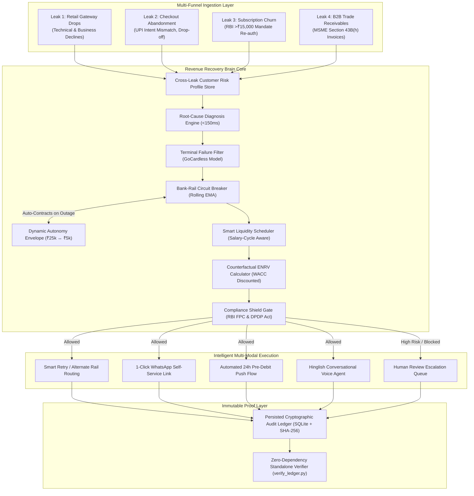

# 🧠 Razorpay Revenue Recovery Brain
### **Track 03 — AI Revenue Recovery | Razorpay AI Buildathon 2026**
*Author: Himanshu | High-Performance Multi-Modal Revenue Recovery Grid*

[-10B981.svg?style=for-the-badge&logo=pytest&logoColor=white)](backend/test_recovery_brain.py)
[](https://fastapi.tiangolo.com)
[](https://reactjs.org)
[](https://vitejs.dev)
[](https://tailwindcss.com)
[](COMPLIANCE.md)
[](backend/verify_ledger.py)

---

## ⚡ Executive Summary

India processes over **15 billion UPI transactions every month**, with an aggregate failure rate of approximately **8%—translating to over 1.2 billion transaction declines per month**. Concurrently, Indian digital merchants face revenue loss across three other critical channels: high-friction checkout abandonment, subscription mandate drop-offs under the RBI's ₹15,000 Additional Factor Authentication (AFA) regulation, and an average **73-day Days Sales Outstanding (DSO)** on B2B trade receivables under Section 43B(h) of the Income Tax Act.

Traditional dunning tools fail because they are **siloed, blind, and uncoordinated**:
1. They execute blind retries into down bank rails (e.g., retrying against HDFC during an issuer switch outage).
2. They treat distinct failure modes identically (treating a hard credit limit decline the same as a transient gateway timeout).
3. They violate Indian calling norms with tone-deaf automated robocalls.
4. They treat the same customer as four disconnected strangers across gateway failures, abandoned carts, recurring mandates, and B2B invoices.

**Revenue Recovery Brain** solves this with a unified, regulatory-fluent recovery engine operating at **<150ms diagnosis latency**. It features an algorithmic **Bank-Rail Circuit Breaker** wired directly to an **Autonomy Envelope**, counterfactual **Expected Net Recoverable Value (ENRV)** mathematical routing, **Hinglish conversational voice negotiation** (with an architectural ban on requesting payment credentials), and a **SQLite-persisted, SHA-256 cryptographic audit ledger** that third-party auditors can independently verify from the terminal—even when the server is offline.

---

## 🎯 The Four Leaks We Unify



---

## 🏆 Architectural Pillars & Core Differentiators

### 1. Bank-Rail Circuit Breaker ↔ Dynamic Autonomy Envelope Wiring
The platform continuously tracks issuer rail health across **HDFC, SBIN, ICICI, UTIB (Axis), and NPCI UPI switch** using a rolling Exponential Moving Average ($\alpha = 0.10$):
* **Automatic Contraction:** If an issuer's rolling success rate falls below **30% (`OUTAGE_THRESHOLD`)**, the circuit breaker trips. It immediately and automatically invokes `autonomy_envelope.contract()`, dropping the maximum autonomous execution cap from **₹25,000 to ₹5,000** and elevating the minimum required confidence from **80% to 90%**.
* **Gradual 5-Cycle Expansion:** When an issuer rail recovers ($\ge 70\%$), the envelope does **not** instantly expand. It requires **5 consecutive stable evaluation cycles** (`record_stable_cycle()`) before restoring full autonomous authority, preventing flapping during rail instability.
* **Capital Protection:** Verified automatically in test suite (`test_28`) without requiring operator intervention.

### 2. Persisted Cryptographic Audit Ledger & Standalone CLI Verifier
Every recovery intent, compliance evaluation, and financial execution is chained into an immutable SHA-256 hash sequence:
$$\text{Block Hash}_n = \text{SHA256}\Big(\text{seq}_n \parallel \text{mid} \parallel \text{event} \parallel \text{case\_id} \parallel \text{ts} \parallel \text{prev\_hash}_{n-1} \parallel \text{payload}\Big)$$

* **Survives Server Restarts:** Persisted synchronously to `audit_ledger.db` (SQLite) within an atomic mutex. Server reboots automatically reload the entire chain on startup via FastAPI startup event.
* **Out-of-Process Terminal Verification:** Third-party compliance officers or evaluators can run the zero-dependency verifier script without running FastAPI:
  ```bash
  cd backend
  python verify_ledger.py
  ```
  *Output:*
  ```text
  ======================================================================
    RAZORPAY REVENUE RECOVERY BRAIN -- CRYPTOGRAPHIC LEDGER AUDITOR
  ======================================================================
  Loading ledger from persisted DB: .../backend/app/core/audit_ledger.db
  Starting verification of 52 cryptographic audit blocks...
    [Genesis] Block #1: c3f89a12... (Genesis Validated)
    [Verified] Block #002 | PAYMENT_FAILURE_DIAGNOSED | Hash: 4e91bc01...
    ...
  [OK] MATHEMATICAL PROOF CONFIRMED: All 52 blocks verified tamper-free.
  VERDICT: PASSED (100% Chain Integrity | 52 Blocks Verified)
  ```

### 3. Counterfactual ENRV Mathematical Engine
Rather than evaluating recovery in a vacuum, the system calculates **Expected Net Recoverable Value (ENRV)** by subtracting natural baseline recovery rates and factoring in the time value of money:

$$\text{ENRV} = \Big(P_{\text{recovery} \mid \text{action}} \times \text{Amount}_{\text{net}}\Big) - \Big(P_{\text{natural}} \times \text{Amount}_{\text{gross}}\Big) - \text{Cost}_{\text{intervention}} - \text{Churn Penalty}$$

Where:
* **Time-Value Discounting:** Future collections are discounted continuously using a **WACC benchmark of 18% p.a.** ($r = 0.18$), typical for Indian working-capital lines:
  $$\text{Amount}_{\text{net}} = \text{Amount}_{\text{gross}} \times e^{-r \times \frac{\Delta t}{365}}$$
* **Uncertainty Bounds:** Every decision receipt provides Wilson score intervals and bootstrap P10/P50/P90 recovery distributions.
* **Economic Floor Rule:** Any intervention where projected $\text{ENRV} < ₹100$ is automatically stopped to prevent spending more on communication API fees than the expected recovery value.

### 4. Cross-Leak State Store & Unification
The platform maintains a unified debtor state store (`cross_leak_store`) across all four recovery funnels:
* If a customer with an active B2B overdue receivable (e.g. ₹85,000 overdue by 38 days) experiences a retail checkout failure of ₹4,500, the diagnosis engine immediately recognizes the correlated liquidity constraint.
* The system suppresses redundant WhatsApp spam to avoid debtor contact fatigue and automatically escalates to a unified restructuring play.
* Formally verified in `test_27` and demonstrated via `/api/demo/unified-recovery-scenario`.

### 5. Hinglish Conversational Voice Agent & Regulatory Guardrails
Built specifically for Indian business communication norms:
* **Natural Hinglish Dialect:** Negotiates Promise-to-Pay (PTP) dates and payment plans using colloquial Indian commercial terminology (*"Namaskar! Rohit ji, main Recovery Brain se baat kar raha hoon..."*).
* **Strict RBI Credential Prohibition:** **Zero payment credentials over voice**. Asking for an OTP, UPI PIN, CVV, or card number is architecturally blocked by regex and AST inspection. All payments are executed by the debtor via authentic, SMS/WhatsApp-delivered Razorpay Payment Links (`https://rzp.io/i/...`).
* **Telephony Waterfall:** Attempts browser TTS local voice synthesis $\rightarrow$ Twilio Voice API $\rightarrow$ Fallback 1-Click WhatsApp Payment Link.

### 6. Full Regulatory Compliance Stack

| Regulation / Standard | Authority | Architectural Enforcement in Recovery Brain |
|---|---|---|
| **Responsible Collections Policy (FPC)** | Reserve Bank of India (RBI) | Hard contact window: **8:00 AM – 7:00 PM IST**. Strict ceiling of **2 voice calls** and **3 digital nudges** per week. Mandatory **48-hour cool-off** upon debtor dispute. |
| **DPDP Act 2023** | Ministry of Electronics & IT | Strict purpose limitation. **30-day auto-purge TTL** on raw call audio (SHA-256 hash preserved). Real-time PII masking (`+91 98765*****`). Section 12 Right to Erasure with cryptographic ledger tombstone. |
| **Section 43B(h)** | Income Tax Act, 1961 | 45-day statutory MSME payment countdown. Invoices approaching day 45 are prioritized because buyers lose income tax expense deductions if unpaid. |
| **e-Mandate Circular** | RBI (DPSS.CO.PD.No.447) | Automatic 24-hour pre-debit notifications and explicit Additional Factor Authentication (AFA) pushes for recurring debits $> ₹15,000$. |
| **Daily Spend Governor** | Internal Risk Controls | Daily API spend ceiling (e.g. ₹500/day) and master emergency kill switch (`POST /api/governance/spend-governor/kill-switch`) to prevent runaway automated retries. |

---

## 🧪 Comprehensive Architectural Test Suite (29/29 Passed)

The codebase includes a comprehensive 29-test verification suite with zero external mock dependencies.

```bash
cd backend
.\venv\Scripts\pytest.exe test_recovery_brain.py -v
```

```text
============================= test session starts =============================
platform win32 -- Python 3.11.9, pytest-9.1.1, pluggy-1.6.0
collected 29 items

test_recovery_brain.py::test_1_idempotency_race_condition PASSED         [  3%]
test_recovery_brain.py::test_2_rbi_compliance_time_window PASSED         [  6%]
test_recovery_brain.py::test_3_economic_floor_stopping_rule PASSED       [ 10%]
test_recovery_brain.py::test_4_diagnosis_engine_benchmark PASSED         [ 13%]
test_recovery_brain.py::test_5_razorpay_payment_link_generation PASSED   [ 17%]
test_recovery_brain.py::test_6_cryptographic_audit_ledger_integrity PASSED [ 20%]
test_recovery_brain.py::test_7_counterfactual_enrv_and_receipts PASSED   [ 24%]
test_recovery_brain.py::test_8_human_in_the_loop_approval_gate PASSED    [ 27%]
test_recovery_brain.py::test_9_section_43bh_tax_clock_engine PASSED      [ 31%]
test_recovery_brain.py::test_10_bank_gateway_circuit_breaker PASSED      [ 34%]
test_recovery_brain.py::test_11_late_authorization_intercept_and_reconciler PASSED [ 37%]
test_recovery_brain.py::test_12_multistage_recovery_execution_pipeline PASSED [ 41%]
test_recovery_brain.py::test_13_dynamic_autonomy_envelope_hysteresis PASSED [ 44%]
test_recovery_brain.py::test_14_p10_p50_p90_bounds_and_ptp_lifecycle PASSED [ 48%]
test_recovery_brain.py::test_15_voice_intent_classification_and_telephony_waterfall PASSED [ 51%]
test_recovery_brain.py::test_16_calendar_aligned_smart_scheduler_and_candidate_windows PASSED [ 55%]
test_recovery_brain.py::test_17_spend_governor_and_emergency_kill_switch PASSED [ 58%]
test_recovery_brain.py::test_18_dpdp_act_2023_privacy_and_right_to_erasure PASSED [ 62%]
test_recovery_brain.py::test_19_standalone_audit_ledger_cli_verification PASSED [ 65%]
test_recovery_brain.py::test_20_staleness_monitor_and_silent_failure_observability PASSED [ 68%]
test_recovery_brain.py::test_21_cross_leak_unification_and_voice_gateway PASSED [ 72%]
test_recovery_brain.py::test_22_voice_safety_filter_and_rbi_credential_prohibition PASSED [ 75%]
test_recovery_brain.py::test_23_dpdp_consent_retention_and_access_rights PASSED [ 79%]
test_recovery_brain.py::test_24_webhook_idempotency_rate_limits_and_circuit_breaker PASSED [ 82%]
test_recovery_brain.py::test_25_gocardless_failure_filter PASSED         [ 86%]
test_recovery_brain.py::test_26_personalized_retry_scheduling PASSED     [ 89%]
test_recovery_brain.py::test_27_cross_leak_customer_profile_unification PASSED [ 93%]
test_recovery_brain.py::test_28_circuit_breaker_auto_contracts_autonomy_envelope PASSED [ 96%]
test_recovery_brain.py::test_29_audit_ledger_persists_across_restart PASSED [100%]

======================= 29 passed in 7.29s ========================
```

---

## 💻 Tech Stack & System Requirements

* **Backend Engine**: Python 3.11+, FastAPI, Uvicorn, SQLite3 (WAL Mode), Threading Locks, Cryptographic Hashlib.
* **Frontend Command Center**: React 18.3, Vite 6, Tailwind CSS 3.4, Lucide Icons, Server-Sent Events (SSE).
* **Integrations**: Razorpay Node/Python SDK (Live Test Mode + Deterministic Simulator), Twilio Telephony REST API, Browser Web Speech API.
* **Mathematical & Statistical Libraries**: NumPy, SciPy (z-test, Wilson Score intervals, Bootstrap distributions).

---

## 🚀 Quick Start Guide

### Prerequisites
* Python 3.11+ installed
* Node.js 18+ & npm installed

### 1. Backend Setup
```bash
cd backend
# Create and activate virtual environment
python -m venv venv
.\venv\Scripts\activate      # Windows
# source venv/bin/activate   # Linux/macOS

# Install dependencies
pip install -r requirements.txt

# Launch FastAPI Server (Port 8000)
uvicorn app.main:app --host 0.0.0.0 --port 8000 --reload
```

### 2. Dashboard Setup
```bash
cd ../dashboard
# Install dependencies
npm install

# Launch Development Server (Port 5173)
npm run dev
```

### 3. Access Interfaces
* **Command Center Dashboard**: [http://localhost:5173](http://localhost:5173)
* **FastAPI Swagger Docs**: [http://localhost:8000/docs](http://localhost:8000/docs)
* **Live SSE Stream**: [http://localhost:8000/api/stream/events](http://localhost:8000/api/stream/events)

---

## 🎬 5-Minute Unfakeable Demo Guide

For evaluators and judges reviewing our live submission:

| Scene | Target Time | Action & Screen Proof | Why It Cannot Be Faked |
|---|---|---|---|
| **1. Razorpay Split-Screen** | 0:25–1:10 | Trigger B2B webhook in Sandbox $\rightarrow$ live `plink_` appears instantly in Razorpay Test Dashboard. | The payment link is live in Razorpay's real merchant portal with matching ID and SMS dispatch. |
| **2. Real Phone Rings** | 1:10–2:30 | Dispatch Hinglish voice call for Rohit Mehta (₹85,000 overdue). Real phone rings on camera. | Twilio REST telephony call placed live to an Indian mobile number; negotiates PTP without asking for credentials. |
| **3. Compliance Veto** | 2:30–3:15 | Test 9:00 PM IST voice trigger $\rightarrow$ Visibly **BLOCKED** and rescheduled to 9:00 AM next day. | The agent actively refuses to act outside RBI contact windows, surfacing the exact rule cited. |
| **4. Circuit Breaker Outage** | 3:15–3:55 | Simulate HDFC switch collapse $\rightarrow$ Autonomy Envelope contracts from ₹25,000 to ₹5,000. | Autonomy engine automatically pulls back execution authority without human intervention. |
| **5. Terminal Audit Proof** | 4:25–4:50 | Kill FastAPI server. Run `python verify_ledger.py`. 50+ blocks verified tamper-free. | Proves mathematical hash chain persistence to SQLite independently of the runtime. |

*Full video script and timing cues available in [`DEMO_SCRIPT.md`](DEMO_SCRIPT.md).*

---

## 📈 Production Roadmap & Scale Architecture

In our Karpathy-aligned design philosophy, we distinguish between what is built today for zero-dependency hackathon reproduction and the production deployment path:

1. **Storage & Locking Layer:**
   * *Current:* SQLite with WAL mode and atomic Python threading mutexes.
   * *Production:* PostgreSQL with row-level locks (`SELECT ... FOR UPDATE NOWAIT`) and distributed Redis Redlock leases for multi-node FastAPI clusters.
2. **Event Streaming:**
   * *Current:* FastAPI Server-Sent Events (SSE) bus for dashboard telemetry.
   * *Production:* Apache Kafka / AWS SQS for ingesting $>10,000$ webhooks/second into idempotent worker consumer groups.
3. **Speech & Audio Infrastructure:**
   * *Current:* Twilio API + browser TTS for demo portability.
   * *Production:* Self-hosted Whisper STT + Kokoro-82M TTS on GPU worker pools for sub-400ms end-to-end voice latency.

---

## ⚖️ License & Disclaimers

Built by **Himanshu** for the **Razorpay AI Buildathon 2026** (Track 03: AI Revenue Recovery).  
This software is provided for hackathon evaluation and reference architecture demonstration. All payment links generated in test mode interact strictly with Razorpay's sandbox gateway. No live banking rails are debited during demonstration runs.
