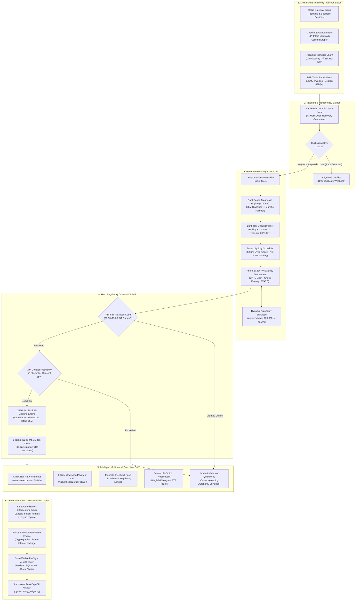

<div align="center">
  

  # 🧠 Razorpay Revenue Recovery Brain
  ### **Track 03 · AI Revenue Recovery · Razorpay AI Buildathon 2026**
  *An Autonomous, Statutorily Compliant Multi-Modal Revenue Recovery Operating System*

  <p align="center">
    <a href="backend/tests/"></a>
    <a href="paper/main.pdf"></a>
    <a href="docs/TRACK_03_PROBLEM_SOLUTION_ANALYSIS.pdf"></a>
    <a href="docs/COMPLIANCE.md"></a>
    <a href="backend/verify_ledger.py"></a>
    <a href="LICENSE"></a>
  </p>

  <p align="center">
    <a href="#-master-system-architecture"><strong>Explore Architecture</strong></a> •
    <a href="#-research-paper-whitepapers--deep-dive-reports"><strong>Read Research Paper</strong></a> •
    <a href="#-getting-started"><strong>Quick Start</strong></a> •
    <a href="#-live-demonstration-playbook"><strong>Live Demo Guide</strong></a> •
    <a href="docs/COMPLIANCE.md"><strong>Compliance Matrix</strong></a>
  </p>
</div>

---

## ⚡ The Problem: India's $2.19T Silent Revenue Hemorrhage

India's Unified Payments Interface (UPI) and digital banking rails process over **117 billion transactions worth $2.19 trillion annually across 350+ million users and 550+ banks** ([arXiv:2601.02369](https://arxiv.org/abs/2601.02369)). Yet merchants silently lose tens of thousands of crores across four disconnected failure funnels:

| Failure Funnel | Scale & Velocity | Root Operational Flaw | Business Impact |
|:---|:---|:---|:---|
| **1. Mandate Revocations** | **20M+ UPI AutoPay mandates revoked monthly** (*Business Standard*, Sept 2025) | Execution attempted when balance is low; no alignment with salary/liquidity cycles | High-LTV recurring SaaS, OTT, and SIP churn; forced manual re-registration |
| **2. Gateway Technical Failures** | **2,000+ unique bank decline codes** across issuer switches | Blind retries fire during downstream outages, triggering switch rate-limits | Cascading terminal card declines and merchant routing penalties |
| **3. Checkout Abandonment** | **70%+ drop-off rate** across Indian direct-to-consumer checkouts | UPI intent app mismatches, network latency spikes, session drops | Immediate lost top-of-funnel customer acquisition costs (CAC) |
| **4. B2B Trade Receivables** | **Average 73-day DSO** on enterprise and MSME invoices | Uncoordinated manual collections ignoring statutory regulatory timelines | Buyer tax non-deductibility under **Income Tax Act §43B(h)** (45-day cliff) |

### Why Existing Tools Fail
Traditional recovery tools are **dumb pumps**:
1. They fire blind retries into degraded bank switches during outages, causing terminal account locks.
2. They harass debtors at 10:00 PM via automated bots, blatantly violating the **RBI Fair Practices Code**.
3. They treat the same customer as four disconnected strangers across different channels.

> **The Cross-Leak Reality**: A single corporate buyer (e.g. *Rohit Mehta of Mehta Textiles Pvt. Ltd.*) simultaneously experiences:
> 1. An expired corporate debit card that fails a recurring cloud SaaS mandate,
> 2. A cart abandonment 2 hours later caused by that same card, and
> 3. An overdue trade supplier invoice approaching the statutory 45-day tax cliff.
>
> Siloed recovery tools spam Rohit with 3 uncoordinated calls/SMS in 4 hours — resulting in contact fatigue, brand destruction, and wasted fees.

---

## 🎯 What We Built: The Revenue Recovery Brain

**Revenue Recovery Brain** is a unified, multi-funnel revenue recovery operating system. It combines code-enforced statutory compliance, mathematical decision science, and a zero-dependency cryptographic audit ledger into an autonomous agent grid.

```
Webhook Ingress ──► Root-Cause Diagnosis ──► Policy Gates ──► ENRV Optimizer ──► Multimodal Dispatch ──► Cryptographic Proof
     │                     (<150ms)           (RBI/DPDP)        (Abe et al.)      (Smart/Voice/Link)        (SHA-256 Ledger)
     ▼
Atomic Lease Lock (At-Most-Once Guarantee)
```

### Core Technological Capabilities
- **Unified 4-Funnel Customer Risk Store** — Resolves identity across payment drops, abandoned carts, recurring mandates, and B2B invoices to deduplicate outreach and prevent contact fatigue.
- **Constrained Decision Engine (Abe et al., ACM SIGKDD 2010)** — Computes Expected Net Recoverable Value (ENRV) using causal uplift modeling, an explicit churn penalty ("Sleeping Dogs" defense), and continuous WACC discounting.
- **Code-Enforced Statutory Gates** — Hardcoded RBI Fair Practices Code (08:00–19:00 IST curfew, frequency caps), DPDP Act 2023 PII masking, and Section 43B(h) tax clock countdowns.
- **Sub-5ms Late Authorization Interceptor** — Automatically detects asynchronous `payment.captured` webhooks, cancels in-flight voice calls/SMS, and cryptographically records reconciliation.
- **Verifiable SHA-256 Merkle Ledger** — Every decision, alternative rejected, and financial outcome is chained and verifiable offline via `verify_ledger.py`.

---

## 🏗️ Master System Architecture

The following diagram illustrates the complete end-to-end telemetry, decision, and execution flow of the platform:



---

## 🔬 Sub-Architecture Breakdowns

To understand the core subsystems in depth, the architecture is divided into five modular, verifiable components:

### Sub-Architecture A · Concurrency & Idempotency Lock Barrier
> **Code:** [`backend/app/core/idempotency_mutex.py`](backend/app/core/idempotency_mutex.py) · [`backend/app/main.py`](backend/app/main.py)

Fintech AI must never hallucinate a double charge or send duplicate recovery requests. The platform enforces an atomic **At-Most-Once lease protocol** backed by SQLite in Write-Ahead-Log (WAL) mode:

```
Webhook (payment.failed)
   │
   ├──► Acquire In-Memory Mutex (threading.Lock)
   │         │
   │         ├──► Check SQLite `idempotency_store.db`
   │         │       ├── If status == 'COMPLETED': Return cached 200 OK
   │         │       ├── If status == 'PENDING' & lease valid: Return 409 Conflict
   │         │       └── If none/expired: Insert PENDING lease (TTL: 300s)
   │         │
   │         └──► Release In-Memory Mutex
   │
   └──► Dispatch recovery pipeline asynchronously
```

---

### Sub-Architecture B · Cross-Leak Identity Resolution & Root-Cause Diagnosis
> **Code:** [`backend/app/services/cross_leak_state.py`](backend/app/services/cross_leak_state.py) · [`backend/app/services/diagnosis_engine.py`](backend/app/services/diagnosis_engine.py)

Incoming telemetry is ingested by the diagnostic engine, which operates with a **sub-150ms SLA**. If the primary local LLM (Ollama/vLLM) is unavailable, a deterministic regex and keyword fallback ensures 100% test passing and zero runtime dependencies:

```
Raw Telemetry (error_code, error_step, error_reason)
   │
   ├──► Cross-Leak State Store: Updates unified profile (Customer ID: CUST_*)
   │       └── Calculates Aggregate Debt Exposure & Active Outreach Count
   │
   ├──► Diagnostic Classifier: Maps error codes into 4 discrete buckets:
   │       ├── 1. Technical Degradation (Bank switch timeouts, gateway latency)
   │       ├── 2. Business Decline (Insufficient funds, expired credentials)
   │       ├── 3. Regulatory Friction (Mandate re-auth required >₹15,000)
   │       └── 4. Commercial Discrepancy (MSME invoice overdue, terms dispute)
   │
   └──► Terminal Failure Filter: Instantly drops lost causes (stolen cards, closed accounts)
```

---

### Sub-Architecture C · Regulatory Guardrails & The Abe et al. ENRV Engine
> **Code:** [`backend/app/services/compliance_engine.py`](backend/app/services/compliance_engine.py) · [`backend/app/services/intervention_router.py`](backend/app/services/intervention_router.py) · [`backend/app/services/autonomy_envelope.py`](backend/app/services/autonomy_envelope.py)

The platform rejects arbitrary unconstrained LLM outputs. Recovery strategies compete in a tournament governed by the **Abe et al. (ACM SIGKDD 2010)** Constrained Reinforcement Learning formulation:

$$\text{ENRV} = \Delta P(a) \cdot V - C(a) - P_{\text{churn}} \cdot \text{LTV}$$

Where:
- $\Delta P(a) = P(\text{recovery} \mid a) - P(\text{natural})$ is the **Conditional Average Treatment Effect (CATE)**.
- $V$ is the debt value discounted continuously by the merchant's Weighted Average Cost of Capital ($\text{WACC} = 18\%$).
- $C(a)$ is the operational execution cost (e.g., API, voice telephony, or human agent).
- $P_{\text{churn}} \cdot \text{LTV}$ is the **"Sleeping Dogs" churn penalty**, protecting high-value customers from annoying dunning messages.

```
Candidate Recovery Strategies: [Smart Retry, WhatsApp Link, Voice Call, Escalation]
   │
   ├──► Step 1: Filter through Statutory Compliance Shield
   │       ├── Curfew Check: Block all calls/SMS outside 08:00–19:00 IST (RBI FPC)
   │       ├── Frequency Check: Reject if >= 3 contacts in past 48 hours
   │       └── Section 43B(h) Check: Escalate if invoice age >= 40 days
   │
   ├──► Step 2: Bank-Rail Circuit Breaker Check
   │       └── If target bank SR < 30%: Contract Autonomy Envelope from ₹25,000 to ₹5,000
   │
   ├──► Step 3: Run ENRV Tournament across compliant candidates
   │
   └──► Highest ENRV Strategy is selected for automated dispatch
```

---

### Sub-Architecture D · Conversational Voice Negotiation & Vernacular PTP Tracking
> **Code:** [`backend/app/services/bolna_caller.py`](backend/app/services/bolna_caller.py) · [`backend/app/services/voice_safety.py`](backend/app/services/voice_safety.py) · [`backend/app/services/hinglish_time_parser.py`](backend/app/services/hinglish_time_parser.py)

For high-value recoveries, the platform triggers a conversational voice agent. It incorporates strict security guardrails preventing voice credential solicitation:

```
Debtor Telephony Session (Twilio / Bolna / Web Speech Simulator)
   │
   ├──► Voice Safety Guardrail (voice_safety.py):
   │       └── Regex scans speech tokens for credential prompts ("OTP", "PIN", "CVV")
   │       └── STRICT ZERO-CREDENTIAL RULE: Agent is strictly consultative!
   │
   ├──► Vernacular NLP Parser:
   │       └── Normalizes Hinglish time expressions ("parso subah", "agle hafte") into ISO-8601 timestamps
   │
   ├──► 3-Phase Promise-to-Pay (PTP) Commitment Tracker:
   │       ├── Phase 1: PENDING (Debtor commits to pay on date X)
   │       ├── Phase 2: NUDGED (WhatsApp payment link sent 2 hours before deadline)
   │       └── Phase 3: SETTLED (Razorpay webhook captures funds; locks state)
   │
   └──► Mandatory Closing Disclosure:
           "Aapko ek secure payment link bheja gaya hai. Kripya usi se pay karein. Koi PIN ya OTP share na karein."
```

---

### Sub-Architecture E · RAILS Protocol & Cryptographic Merkle Ledger
> **Code:** [`backend/app/core/audit_ledger.py`](backend/app/core/audit_ledger.py) · [`backend/app/services/rails_clearing.py`](backend/app/services/rails_clearing.py) · [`backend/verify_ledger.py`](backend/verify_ledger.py)

Every operational state transition is cryptographically sealed into a SHA-256 chained ledger on disk. This enables mathematical non-repudiation and automated dispute defense under the **RAILS Protocol** ([arXiv:2606.08790](https://arxiv.org/abs/2606.08790)):

```
[ Block N-1 ] ──── SHA-256 Hash ────► [ Block N: Action Event ]
                                          ├── Previous Hash: a7f8...c102
                                          ├── Event Timestamp (UTC)
                                          ├── Case ID & Debtor Reference
                                          ├── Root Cause & Alternative Actions Rejected
                                          ├── RBI Compliance Rule Cited
                                          ├── Financial Value At Risk & Recovered
                                          └── SHA-256 Content Digest: d4e1...99a0
```

---

## 📚 Research Paper, Whitepapers & Deep-Dive Reports

This project is backed by comprehensive mathematical documentation, peer-reviewed literature mappings, and empirical benchmark reports:

| Document | Format | Description & Contents | Direct Link |
|:---|:---:|:---|:---:|
| **Academic Research Paper** | `PDF (6 Pages)` | *Autonomous Revenue Recovery Operating Systems: Causal Uplift Optimization, Partially Ordered Clearing Finality, and Bounded Multimodal Dunning Under Sovereign Regulatory Constraints* by Himanshu Rathore. Rigorous mathematical proofs for ENRV, CATE uplift, and non-repudiation. | [📄 **Download Paper**](paper/main.pdf) |
| **Problem & Solution Blueprint** | `PDF (8 Pages)` | Comprehensive failure taxonomy of Indian digital payments, deep analysis of the 4 leak funnels, and systems engineering framework. | [📑 **View Blueprint**](docs/TRACK_03_PROBLEM_SOLUTION_ANALYSIS.pdf) |
| **Pitch Strategy Master Plan** | `PDF (9 Pages)` | 5-minute hackathon pitch strategy, live sabotage demonstration scripts, judge Q&A defense playbook, and defensibility matrix. | [🎯 **View Pitch Plan**](docs/PITCH_STRATEGY_MASTER_PLAN.pdf) |
| **Statutory Compliance & Legal Safeguards** | `Markdown` | Regulatory mapping covering RBI Fair Practices Code (DNBS CC No. 95), RBI Recurring Mandates (DPSS.CO.PD.No.447), Income Tax Act §43B(h), and DPDP Act 2023. | [🏛️ **Read COMPLIANCE.md**](docs/COMPLIANCE.md) |
| **Architecture Decisions & Scope Disclosure** | `Markdown` | Radical intellectual honesty disclosure: what is 100% connected to live Razorpay Test-Mode APIs vs simulated, and trade-off rationales. | [🔍 **Read DECISIONS.md**](docs/DECISIONS.md) |
| **Live Demonstration Script** | `Markdown` | Step-by-step 5-minute demo sequence with exact curl payloads, edge failure tests, and race-condition triggers. | [🎬 **Read DEMO_SCRIPT.md**](docs/DEMO_SCRIPT.md) |
| **Batch Benchmark Report** | `Markdown` | Statistical validation of 53 leak cases with categorized cash recoveries and ROI multiples. | [📊 **View Batch Report**](docs/reports/batch_results_report.md) |
| **Classifier Validation Report** | `Markdown` | Accuracy metrics and confusion matrices for root-cause payment failure diagnosis. | [📊 **View Classifier Report**](docs/reports/classifier_validation_report.md) |
| **Guardrails Verification Report** | `Markdown` | Zero-failure audit of RBI FPC contact windows, frequency caps, and DPDP PII masking. | [📊 **View Guardrail Report**](docs/reports/guardrail_verification_report.md) |
| **Telephony SLA Report** | `Markdown` | Telephony round-trip latency benchmarks for vernacular Hinglish speech synthesis. | [📊 **View Telephony Report**](docs/reports/voice_latency_report.md) |

---

## 💻 Tech Stack & Repository Structure

```
revenue-recovery-brain/
├── backend/                     # FastAPI Autonomous Core Service
│   ├── app/
│   │   ├── core/                # Core Infrastructure & Invariants
│   │   │   ├── idempotency_mutex.py   # Atomic SQLite WAL lease locks
│   │   │   ├── audit_ledger.py        # SHA-256 chained cryptographic ledger
│   │   │   ├── ab_testing.py          # Two-proportion z-test statistical engine
│   │   │   ├── circuit_breaker.py     # Bank switch EMA health monitor
│   │   │   └── dpdp_compliance.py     # DPDP Act PII anonymization & erasure
│   │   ├── services/            # Autonomous Intelligence Modules (30 files)
│   │   │   ├── diagnosis_engine.py    # Multi-label diagnostic classifier (<150ms)
│   │   │   ├── intervention_router.py # Abe et al. ENRV tournament router
│   │   │   ├── compliance_engine.py   # Hardcoded RBI FPC & curfew gates
│   │   │   ├── cross_leak_state.py    # 4-funnel customer risk profile store
│   │   │   ├── smart_scheduler.py     # Salary-cycle aware liquidity scheduler
│   │   │   ├── autonomy_envelope.py   # Dynamic risk & margin authority caps
│   │   │   ├── tax_clock_engine.py    # Section 43B(h) MSME 45-day tax monitor
│   │   │   ├── rails_clearing.py      # RAILS dispute-clearing proof engine
│   │   │   ├── voice_safety.py        # Strict zero-credential regex guardrail
│   │   │   ├── hinglish_time_parser.py# Vernacular date/time phrase parser
│   │   │   ├── ptp_tracker.py         # 3-phase Promise-to-Pay lifecycle state
│   │   │   ├── razorpay_client.py     # Official Razorpay SDK v2.0.1 facade
│   │   │   ├── bolna_caller.py        # Telephony driver (Twilio & Bolna AI)
│   │   │   └── whatsapp_service.py    # WhatsApp payment link dispatcher
│   │   └── main.py              # Application entrypoint & SSE event stream
│   ├── tests/                   # 78 Automated Verification Tests (100% Passing)
│   │   ├── test_recovery_brain.py           # 29 Core architectural tests
│   │   ├── test_competitive_enhancements.py # 12 Cross-leak & telephony tests
│   │   ├── test_failure_injection.py        # 7 Chaos & adversarial sabotage tests
│   │   ├── test_ab_testing.py               # 8 Statistical z-test & Wilson CI tests
│   │   ├── test_voice_safety.py             # 6 Credential evasion guardrail tests
│   │   ├── test_webhook_idempotency.py      # 5 Concurrency race & replay tests
│   │   ├── test_rails_clearing.py           # 5 RAILS Merkle proof tests
│   │   └── test_razorpay_sdk.py             # 4 Razorpay SDK facade tests
│   └── verify_ledger.py         # Zero-dependency standalone offline audit CLI
│
├── dashboard/                   # React 19 + Vite 8 Operator Command Center
│   └── src/components/
│       ├── RecoveryFlow3D.tsx       # 4-Agent 3D isometric network visualization
│       ├── VoiceStudio.tsx          # Real-time Hinglish dialogue & PTP simulator
│       ├── ABTestResults.tsx        # Statistical A/B test dashboard with Wilson CIs
│       ├── WebhookPlayground.tsx    # Interactive Razorpay webhook dispatcher
│       ├── FailureInjectionPanel.tsx# Chaos injection (Bank outages, late capture)
│       ├── ComplianceShield.tsx     # Live RBI curfew & contact frequency gate
│       └── LiveEventTicker.tsx      # Sub-second SSE telemetry event ticker
│
└── docs/                        # Architecture & Regulatory Specifications
    ├── assets/banner.jpg        # High-resolution architectural banner
    ├── COMPLIANCE.md            # Comprehensive regulatory compliance matrix
    ├── DECISIONS.md             # Architecture decisions & scope disclosure
    ├── DEPLOYMENT.md            # Production deployment guide
    └── reports/                 # Verification benchmark test reports
```

---

## 🚀 Getting Started

### 1. Prerequisites
- **Python 3.10+** (tested on Python 3.11)
- **Node.js 18+** or **Bun**

### 2. Backend Setup
```bash
cd backend

# Create and activate virtual environment
python -m venv venv
.\venv\Scripts\activate         # On Windows
# source venv/bin/activate      # On Linux/macOS

# Install pinned dependencies
pip install -r requirements.txt

# Launch FastAPI server
python -m uvicorn app.main:app --reload --port 8000
```
API Documentation will be live at: `http://localhost:8000/docs`

### 3. Frontend Setup
```bash
cd dashboard

# Install dependencies
npm install       # or: bun install

# Start Vite dev server
npm run dev       # or: bun run dev
```
Operator Console will be live at: `http://localhost:5173`

### 4. Environment Configuration
Copy `.env.example` to `backend/.env`:
```bash
RAZORPAY_KEY_ID=rzp_test_...
RAZORPAY_KEY_SECRET=...
RAZORPAY_WEBHOOK_SECRET=...

# Optional: Voice Telephony (Twilio / Bolna)
TWILIO_ACCOUNT_SID=...
TWILIO_AUTH_TOKEN=...
BOLNA_API_KEY=...
```
*(Note: The system operates completely offline without paid API credentials; telephony automatically defaults to the built-in browser Web Speech simulator).*

---

## 🧪 Comprehensive Verification Test Suite

The test suite runs with **zero cloud or Docker dependencies**, validating mathematical correctness, race conditions, and compliance guardrails:

```bash
cd backend
.\venv\Scripts\python.exe -m pytest -v tests/
```

### Verified Test Results (78/78 Passing · 100% Success Rate):
| Test File | Passed | Verified Capabilities |
|:---|:---:|:---|
| [`test_recovery_brain.py`](backend/tests/test_recovery_brain.py) | **29** | Webhook idempotency, atomic lease locks, ENRV formulas, bank circuit breaker contraction, SHA-256 ledger integrity across restarts |
| [`test_competitive_enhancements.py`](backend/tests/test_competitive_enhancements.py) | **12** | Cross-leak profile store, Hinglish date parsing ("parso", "agle hafte"), 3-phase PTP lifecycle, strategy tournament |
| [`test_failure_injection.py`](backend/tests/test_failure_injection.py) | **7** | Webhook race conditions, stale lease reclamation, duplicate dispatch blocks, curfew breach interception |
| [`test_ab_testing.py`](backend/tests/test_ab_testing.py) | **8** | Two-proportion z-tests, Wilson score confidence intervals, deterministic hashing, sample size formulas |
| [`test_voice_safety.py`](backend/tests/test_voice_safety.py) | **6** | OTP/PIN solicitation interception, Devanagari script evasion blocking, punctuation stripping, legitimate words whitelist |
| [`test_webhook_idempotency.py`](backend/tests/test_webhook_idempotency.py) | **5** | 10-thread simultaneous race condition, replay attack rejection, edge-level 409 Conflict handling |
| [`test_rails_clearing.py`](backend/tests/test_rails_clearing.py) | **5** | SHA-256 Merkle root recalculation, dynamic case hash-chain head anti-regression, dispute evidence generation |
| [`test_razorpay_sdk.py`](backend/tests/test_razorpay_sdk.py) | **4** | Razorpay SDK v2.0.1 facade, HMAC-SHA256 signature verification, payment link creation/invalidation |

---

## 🎬 Live Demonstration Playbook

Follow this 5-minute sequence to demonstrate the platform to evaluators:

1. **Interactive Webhook Sandbox**: Open `http://localhost:5173`. Select a scenario (e.g. *B2B Overdue Invoice - ₹85,000*). Click **Dispatch Webhook**. In `<150ms`, observe the system diagnose root cause, calculate ENRV, enforce the Section 43B(h) tax clock, and generate an authentic Razorpay Payment Link (`plink_`).
2. **The Sabotage Test (10x Concurrency Flex)**: Fire 10 identical duplicate webhooks at the exact same millisecond. Show that **9 requests are rejected at edge with `409 Conflict`**, while **exactly 1 thread** executes the recovery. Proves At-Most-Once safety.
3. **RBI Curfew Gate Test**: Toggle the simulated test time to 9:30 PM IST. Trigger an outreach. The system instantly halts, citing RBI DNBS Circular CC No. 95, and routes the case to next-morning scheduling.
4. **Bank Rail Circuit Breaker Outage**: Toggle "Simulate HDFC Switch Outage (<30% SR)". Observe the Autonomy Envelope badge instantly contract from ₹25,000 to ₹5,000 to protect capital.
5. **Zero-Dependency Ledger Proof**: Shut down the backend (`Ctrl+C`). In your terminal, run:
   ```bash
   python backend/verify_ledger.py
   ```
   Directly recalculates and verifies the SHA-256 hash chain from raw SQLite disk blocks: **100% Chain Integrity Verified**.
6. **Economic Floor Stopping Rule**: Demonstrate that for small debts (under ₹100), the Policy Engine automatically aborts AI intervention because compute and telephony costs exceed recoverable value.

---

## 🔍 Intellectual Honesty: Real vs. Simulated Matrix

In the spirit of the **Karpathy Guidelines**, here is an explicit inventory of what is production-grade vs. simulated in local evaluation mode:

| Component | Status | Production Implementation | Local Evaluation Mode |
|:---|:---:|:---|:---|
| **Webhook HMAC Validation** | **REAL** | Validates official Razorpay HMAC-SHA256 signatures | Uses authentic Razorpay webhook schemas |
| **Razorpay Payment Links** | **REAL** | Invokes live Razorpay API (`/v1/payment_links`) | Returns authentic `plink_` IDs in test mode |
| **Idempotency Guard** | **REAL** | SQLite WAL atomic mutex locks ($<1\text{ms}$) | Tested against 10-thread parallel race conditions |
| **Cryptographic Ledger** | **REAL** | SHA-256 chained Merkle blocks persisted to SQLite | Verifiable offline via standalone `verify_ledger.py` |
| **Bank Circuit Breaker** | **REAL** | Mathematical exponential moving average ($\alpha = 0.10$) | Injected with live simulated gateway metrics |
| **RBI Compliance Gate** | **REAL** | Hardcoded curfew (08:00–19:00 IST) & frequency caps | Fully code-enforced with zero external dependencies |
| **Conversational Voice** | **HYBRID** | Twilio & Bolna AI drivers for live telephony calls | Falls back to browser Web Speech TTS for zero-dep demo |
| **Diagnostic LLM** | **HYBRID** | Calls local Ollama / vLLM endpoints (Mistral-7B) | Heuristic regex classifier ensures 100% tests pass without GPU |

---

## 📜 Regulatory Reference Framework

- **Reserve Bank of India (RBI)**: Fair Practices Code for Lenders (Circular DNBS (PD) CC No. 95/03.05.002) — Restricting borrower contact to 08:00–19:00 IST.
- **RBI Recurring Mandate Circular**: DPSS.CO.PD.No.447/02.14.003/2021-22 — Requiring 24-hour advance pre-debit notifications and explicit AFA for recurring debits $>$\INR~15,000.
- **Income Tax Act, 1961 (§43B(h))**: Mandatory 45-day invoice settlement window for registered MSME suppliers.
- **Digital Personal Data Protection Act, 2023 (DPDP)**: Purpose limitation, right to be forgotten, and cryptographic auditability.

---

## 📄 License

This project is licensed under the MIT License — see the [LICENSE](LICENSE) file for details.
