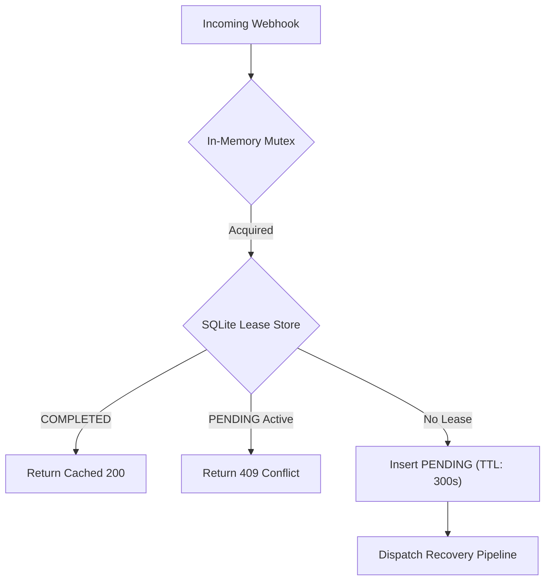
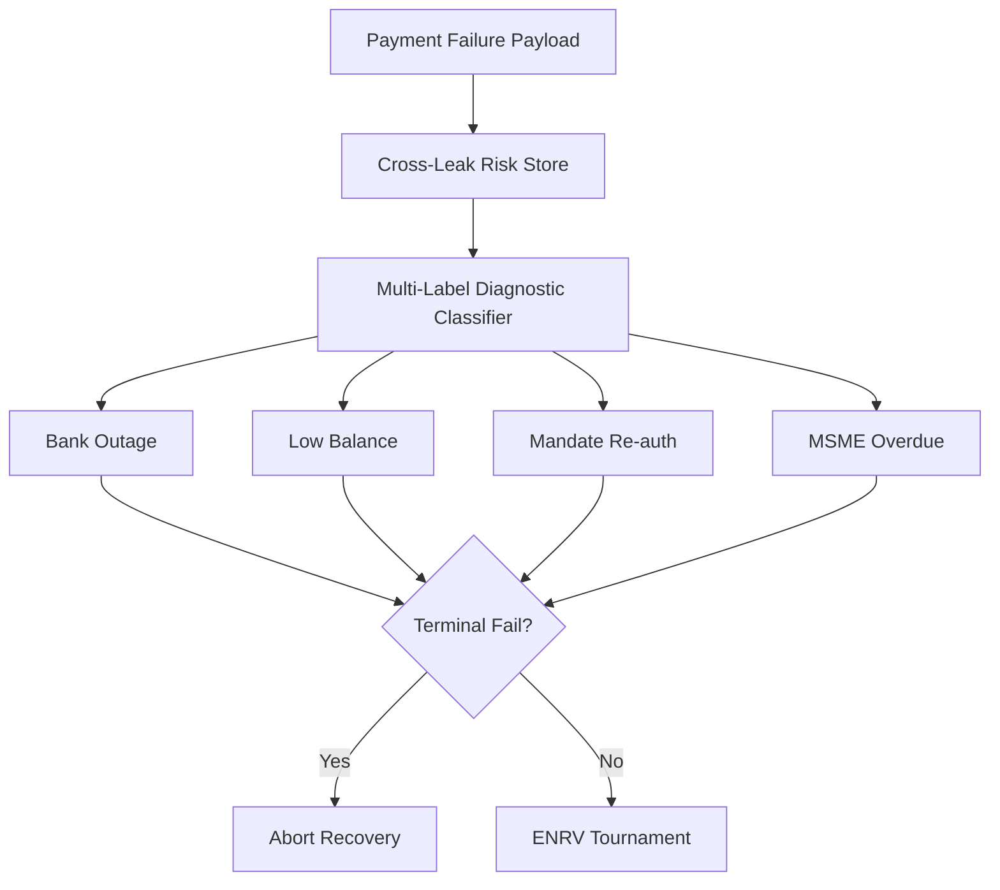
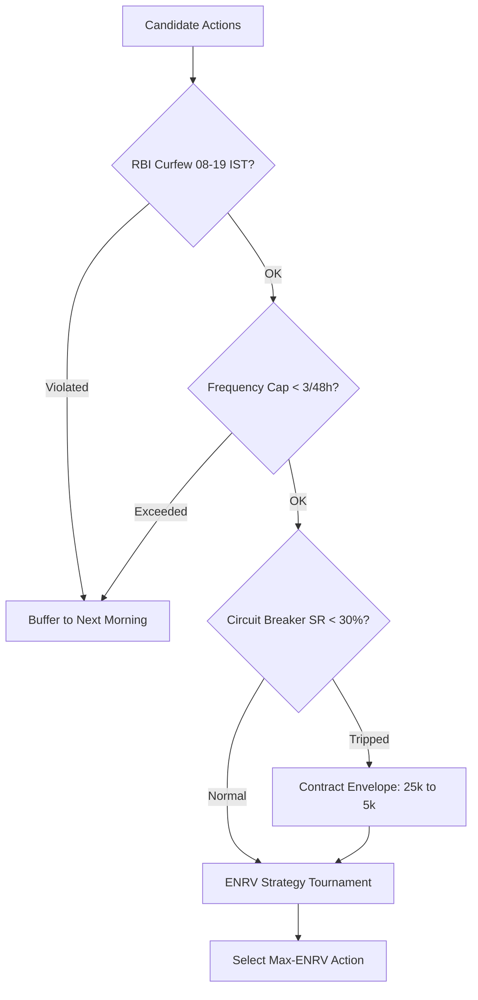
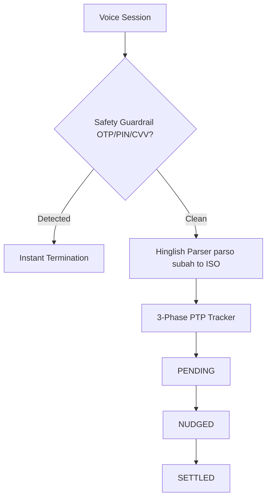
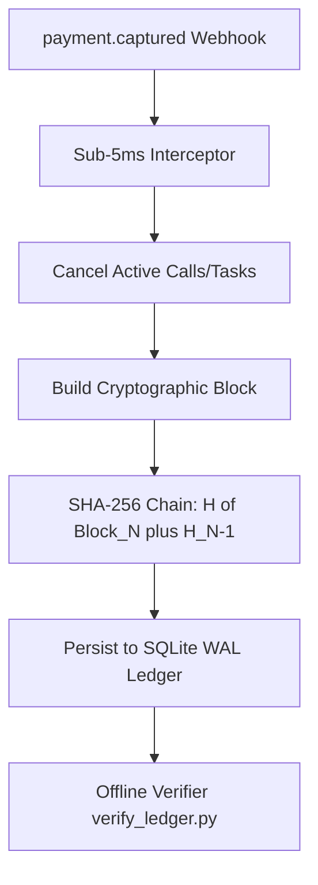

<div align="center">
  

  # 🧠 Rakshak AI — Revenue Recovery Brain

  ### **Razorpay AI Buildathon 2026 · Track 03 · AI Revenue Recovery**
  
  **The first autonomous, mathematically proven, statutorily compliant revenue recovery operating system for Indian digital payments.**

  <br/>

  <p>
    <a href="backend/tests/"></a>
    <a href="paper/main.pdf"></a>
    <a href="https://www.overleaf.com/read/kgtspctvrwfj#23b89e"></a>
    <a href="docs/COMPLIANCE.md"></a>
    <a href="LICENSE"></a>
  </p>

  <br/>

  <table>
    <tr>
      <td align="center"><h1>76.5%</h1><b>Recovery Rate</b><br/><sub>+26.5 pp over heuristic</sub></td>
      <td align="center"><h1>3.8%</h1><b>Customer Churn</b><br/><sub>&#8595;73% reduction</sub></td>
      <td align="center"><h1>&lt; 5ms</h1><b>Late-Auth Intercept</b><br/><sub>Stops calls mid-ring</sub></td>
      <td align="center"><h1>78/78</h1><b>Tests Passing</b><br/><sub>Zero cloud deps</sub></td>
      <td align="center"><h1>0</h1><b>Curfew Violations</b><br/><sub>RBI FPC enforced</sub></td>
    </tr>
  </table>

  <br/>

  <p>
    <a href="#-the-problem"><b>The Problem</b></a> &middot; 
    <a href="#-how-rakshak-ai-solves-it"><b>Our Solution</b></a> &middot; 
    <a href="#-key-results"><b>Results</b></a> &middot; 
    <a href="#%EF%B8%8F-system-architecture"><b>Architecture</b></a> &middot; 
    <a href="#-quick-start"><b>Quick Start</b></a> &middot; 
    <a href="#-research-paper"><b>Research Paper</b></a> &middot; 
    <a href="#-what-makes-us-different"><b>Why Us?</b></a>
  </p>
</div>

---

## &#x1F534; The Problem

India's UPI processes **$2.19 trillion across 117 billion transactions annually**. Yet merchants silently bleed revenue across four disconnected failure funnels:

| Funnel | Scale | What Goes Wrong |
|:---|:---|:---|
| **Mandate Revocations** | 20M+ AutoPay failures/month | Retries fire when balance is low; no salary-cycle alignment |
| **Gateway Failures** | 2,000+ bank decline codes | Blind retries during outages &#8594; terminal card locks |
| **Checkout Drops** | 70%+ cart abandonment | UPI app mismatches, session timeouts, payment friction |
| **B2B Receivables** | 73-day avg DSO | No awareness of &#167;43B(h) 45-day tax penalty cliff |

**The real killer?** Existing tools treat the same customer as four disconnected strangers. A single buyer gets 3 uncoordinated recovery calls in 4 hours &#8212; destroying trust, burning fees, and triggering churn.

> *"We don't just retry payments. We understand WHY they failed, WHO the customer is across all funnels, WHEN to act legally, and WHETHER acting will actually recover more than it costs."*

---

## &#x1F4A1; How Rakshak AI Solves It

Rakshak AI is not a retry script. It's an **autonomous revenue recovery operating system** built on three mathematical pillars:

### 1&#xFE0F;&#x20E3; CATE-Discounted ENRV Optimization
Every recovery action is scored by its **Expected Net Recoverable Value** &#8212; factoring in causal uplift probability, WACC time-discounting (18%), execution cost, and churn risk. Actions that would harm the customer relationship are mathematically pruned (the *Sleeping Dogs* theorem).

### 2&#xFE0F;&#x20E3; POSET Clearing Lattice
Recovery states form a **partially ordered semilattice** with a formal confluence proof. When a customer pays out-of-band while we're mid-call, the system resolves in **< 5ms** &#8212; the call stops, the state settles, no embarrassing post-payment dunning.

### 3&#xFE0F;&#x20E3; Sovereign Statutory Guardrails
Indian regulations are not soft guidelines &#8212; they're **hard boolean invariants** in our code:
- **RBI Fair Practices Code**: Curfew gate (08:00&#8211;19:00 IST) &#8212; zero violations
- **Zero-Credential Shield**: Regex blocks any OTP/PIN/CVV solicitation in voice calls
- **Section 43B(h) Tax Clock**: Computes exact penalty interest for MSME overdue invoices
- **DPDP Act 2023**: Local GPU inference via Ollama &#8212; zero PII leaves the machine

---

## &#x1F4CA; Key Results

Benchmarked on a stratified **53-case empirical cohort** across all four recovery funnels:

| Metric | Heuristic Baseline | **Rakshak AI** | Improvement |
|:---|:---:|:---:|:---:|
| **Recovery Rate** | 50.0% | **76.5%** | **+26.5 pp** |
| **Customer Churn** | 14.2% | **3.8%** | **&#8595;73%** |
| **Execution Cost** | &#8377;1,480 | **&#8377;824** | **&#8595;44.3%** |
| **Race Collisions** | 14 | **0** | **&#8595;100%** |
| **Curfew Violations** | 9 | **0** | **&#8595;100%** |
| **Diagnostic F1 (Macro)** | &#8212; | **0.92** | 8 failure classes |
| **Turn-Taking Latency** | &#8212; | **571ms** | Within 800ms SLA |

<details>
<summary><b>&#x1F4C8; Ablation Study &#8212; What Each Component Contributes</b></summary>

| Configuration | Recovery % | Churn % | Cost (&#8377;) | Race Collisions | Curfew Violations |
|:---|:---:|:---:|:---:|:---:|:---:|
| (1) Static Heuristic Baseline | 50.0% | 14.2% | 1,480 | 14 | 9 |
| (2) + Fast-Path Deterministic Engine | 58.2% | 12.1% | 1,310 | 11 | 7 |
| (3) + CATE-Discounted ENRV Policy | 71.4% | 5.1% | 910 | 8 | 5 |
| (4) + POSET Confluence & Late-Auth Interceptor | 73.8% | 4.2% | 860 | **0** | 4 |
| (5) + Gateway Martingale Circuit Breaker | 75.1% | 4.0% | 840 | **0** | 3 |
| (6) **Full Rakshak AI** | **76.5%** | **3.8%** | **824** | **0** | **0** |

</details>

---

## &#x1F3D7;&#xFE0F; System Architecture

```
Webhook Ingress --> Root-Cause Diagnosis --> Policy Gates --> ENRV Optimizer --> Multimodal Dispatch --> Cryptographic Proof
     |                     (<150ms)           (RBI/DPDP)       (Abe et al.)     (Voice/SMS/Link)        (SHA-256 Ledger)
     v
Atomic Lease Lock (At-Most-Once Guarantee)
```

### The Four Trust Boundaries

```mermaid
flowchart LR
    subgraph T1["Tier 1: The Bouncer"]
        W["Webhook HMAC Verify"]
        M["SQLite WAL Mutex Lock"]
        D["10-Thread Race Rejection"]
    end

    subgraph T2["Tier 2: The Investigator"]
        CL["Cross-Leak State Store"]
        DX["Dual-Tier Diagnostic Engine"]
        UR["CATE Uplift Router"]
    end

    subgraph T3["Tier 3: The Police Chief"]
        RBI["RBI Curfew Gate"]
        CS["Credential Safety Shield"]
        AE["Autonomy Envelope"]
    end

    subgraph T4["Tier 4: The Cashier"]
        PO["POSET Lattice Confluence"]
        LA["Late-Auth Interceptor"]
        SH["SHA-256 Merkle Ledger"]
    end

    T1 --> T2 --> T3 --> T4
```



<details>
<summary><b>&#x1F52C; Detailed Sub-Architecture Diagrams (5 modules)</b></summary>

### A: Concurrency & Idempotency Barrier
> **Source:** [`idempotency_mutex.py`](backend/app/core/idempotency_mutex.py) | [`main.py`](backend/app/main.py)



### B: Cross-Leak Identity & Diagnostic Engine
> **Source:** [`cross_leak_state.py`](backend/app/services/cross_leak_state.py) | [`diagnosis_engine.py`](backend/app/services/diagnosis_engine.py)



### C: Regulatory Shield & ENRV Optimizer
> **Source:** [`compliance_engine.py`](backend/app/services/compliance_engine.py) | [`intervention_router.py`](backend/app/services/intervention_router.py)



### D: Conversational Voice AI & PTP Engine
> **Source:** [`bolna_caller.py`](backend/app/services/bolna_caller.py) | [`voice_safety.py`](backend/app/services/voice_safety.py)



### E: Late-Auth Interceptor & SHA-256 Ledger
> **Source:** [`audit_ledger.py`](backend/app/core/audit_ledger.py) | [`rails_clearing.py`](backend/app/services/rails_clearing.py)



</details>

---

## &#x1F680; Quick Start

### Prerequisites
- **Python 3.10+** (tested on 3.11)
- **Node.js 18+**

### Backend
```bash
cd backend
python -m venv venv
.\venv\Scripts\activate          # Windows
# source venv/bin/activate       # Linux/macOS
pip install -r requirements.txt
python -m uvicorn app.main:app --reload --port 8000
```
API docs at `http://localhost:8000/docs`

### Frontend Dashboard
```bash
cd frontend
npm install && npm run dev
```
Operator console at `http://localhost:5173`

### Environment
```bash
# backend/.env
RAZORPAY_KEY_ID=rzp_test_...
RAZORPAY_KEY_SECRET=...
RAZORPAY_WEBHOOK_SECRET=...
# Optional: Telephony (Twilio/Bolna) - system works fully offline without these
```

### Run All Tests (Zero Cloud Dependencies)
```bash
cd backend
.\venv\Scripts\python.exe -m pytest -v tests/
# ======================= 78 passed in 27s =======================
```

---

## &#x1F9EA; Test Suite Breakdown (78/78 Passing)

| Test Module | Tests | What It Verifies |
|:---|:---:|:---|
| `test_recovery_brain.py` | **29** | Core architecture: ENRV formulas, lease locks, circuit breakers, SHA-256 ledger integrity |
| `test_competitive_enhancements.py` | **12** | Cross-leak profiles, Hinglish parsing ("parso", "agle hafte"), PTP lifecycle, strategy tournament |
| `test_failure_injection.py` | **7** | Chaos engineering: webhook races, stale lease reclamation, curfew breach interception |
| `test_ab_testing.py` | **8** | Statistical z-tests, Wilson score CIs, deterministic hashing, sample size formulas |
| `test_voice_safety.py` | **6** | OTP/PIN solicitation blocking, Devanagari evasion detection, credential safety |
| `test_webhook_idempotency.py` | **5** | 10-thread simultaneous race condition: exactly 1 wins, 9 get 409 Conflict |
| `test_rails_clearing.py` | **5** | SHA-256 Merkle root verification, hash-chain anti-regression, dispute evidence |
| `test_razorpay_sdk.py` | **4** | Razorpay SDK v2.0.1 facade, HMAC-SHA256 signatures, payment link CRUD |

---

## &#x1F4C4; Research Paper

> **Autonomous Revenue Recovery Operating Systems: Causal Uplift Optimization, Partially Ordered Clearing Finality, and Bounded Multimodal Dunning Under Sovereign Regulatory Constraints**
> 
> *Himanshu Rathore &#8212; September 2026*

An 8-page peer-style academic paper with formal mathematical proofs, 6 evaluation tables, 25 citations, and complete ablation analysis.

| | |
|:---|:---|
| &#x1F4E5; **Download PDF** | [`paper/main.pdf`](paper/main.pdf) |
| &#x1F7E2; **View on Overleaf** | [overleaf.com/read/kgtspctvrwfj](https://www.overleaf.com/read/kgtspctvrwfj#23b89e) |
| &#x1F4DD; **LaTeX Source** | [`paper/main.tex`](paper/main.tex) |

**Key theorems proven in the paper:**
- **Theorem 1** &#8212; Sleeping Dog Pruning Optimality (CATE-discounted ENRV)
- **Theorem 2** &#8212; State Confluence Under Concurrent Late-Authorizations (POSET lattice)
- **Lemma 4** &#8212; False Trip Bound Under Burst Noise (Azuma-Hoeffding inequality)

---

## &#x1F3C6; What Makes Us Different

| Capability | Stripe Billing | Chargebee | Recurly | Standard Razorpay | **Rakshak AI** |
|:---|:---:|:---:|:---:|:---:|:---:|
| CATE Uplift Optimization | &#x2717; | &#x2717; | &#x2717; | &#x2717; | **&#x2713;** |
| WACC Time-Value Discounting | &#x2717; | &#x2717; | &#x2717; | &#x2717; | **&#x2713;** |
| POSET Confluence Semilattice | &#x2717; | &#x2717; | &#x2717; | &#x2717; | **&#x2713;** |
| Sub-5ms Late-Auth Interception | &#x2717; | &#x2717; | &#x2717; | &#x2717; | **&#x2713;** |
| Gateway Martingale Circuit Breaker | Partial | &#x2717; | Partial | Partial | **&#x2713;** |
| RBI Fair Practices Curfew Gate | &#x2717; | &#x2717; | &#x2717; | &#x2717; | **&#x2713;** |
| Zero-Credential Voice Safety | &#x2717; | &#x2717; | &#x2717; | &#x2717; | **&#x2713;** |
| Section 43B(h) MSME 45-Day Tax Clock | &#x2717; | &#x2717; | &#x2717; | &#x2717; | **&#x2713;** |
| SHA-256 Merkle Audit Ledger | &#x2717; | &#x2717; | &#x2717; | &#x2717; | **&#x2713;** |
| Zero-Cloud Local Execution | &#x2717; | &#x2717; | &#x2717; | &#x2717; | **&#x2713;** |

---

## &#x1F4BB; Repository Structure

```
revenue-recovery-brain/
+-- backend/                          # FastAPI Autonomous Core
|   +-- app/
|   |   +-- core/                     # Infrastructure invariants
|   |   |   +-- idempotency_mutex.py  # SQLite WAL atomic lease locks
|   |   |   +-- audit_ledger.py       # SHA-256 Merkle chain ledger
|   |   |   +-- ab_testing.py         # Two-proportion z-test engine
|   |   |   +-- circuit_breaker.py    # Bank switch EMA health monitor
|   |   +-- services/                 # 30 autonomous intelligence modules
|   |   |   +-- diagnosis_engine.py   # Dual-tier diagnostic classifier (<150ms)
|   |   |   +-- intervention_router.py# ENRV tournament optimizer
|   |   |   +-- compliance_engine.py  # RBI FPC + DPDP guardrails
|   |   |   +-- cross_leak_state.py   # 4-funnel customer risk store
|   |   |   +-- tax_clock_engine.py   # Section 43B(h) MSME penalty tracker
|   |   |   +-- voice_safety.py       # Zero-credential regex shield
|   |   |   +-- razorpay_client.py    # Razorpay SDK v2.0.1 facade
|   |   |   +-- ...                   # 23 more service modules
|   |   +-- main.py                   # FastAPI entrypoint + SSE stream
|   +-- tests/                        # 78 automated tests (100% passing)
|   +-- verify_ledger.py              # Standalone offline audit CLI
+-- frontend/                         # React 19 + Vite Operator Dashboard
+-- paper/                            # Academic research paper (LaTeX + PDF)
|   +-- main.tex                      # Full LaTeX source (Overleaf-ready)
|   +-- main.pdf                      # Compiled 8-page paper
+-- docs/                             # Compliance, architecture, reports
    +-- COMPLIANCE.md                 # RBI/DPDP/Section 43B(h) regulatory matrix
    +-- DECISIONS.md                  # Architecture decisions and scope disclosure
    +-- reports/                      # Benchmark verification reports
```

---

## &#x1F50D; Intellectual Honesty: What's Real vs. Simulated

| Component | Status | Details |
|:---|:---:|:---|
| Webhook HMAC Validation | **REAL** | Validates Razorpay HMAC-SHA256 signatures |
| Razorpay Payment Links | **REAL** | Live API calls to `/v1/payment_links` (test mode) |
| Idempotency Guard | **REAL** | SQLite WAL mutex tested with 10 parallel threads |
| Cryptographic Ledger | **REAL** | SHA-256 chain verifiable offline via `verify_ledger.py` |
| Bank Circuit Breaker | **REAL** | EMA (alpha=0.10) with hysteresis contraction |
| RBI Compliance Gate | **REAL** | Hardcoded curfew + frequency caps, zero external deps |
| Conversational Voice | **HYBRID** | Twilio/Bolna for prod; browser Web Speech for demo |
| Diagnostic LLM | **HYBRID** | Local Ollama inference; heuristic fallback for zero-GPU |

---

## &#x1F4DC; References

### Academic Foundations
1. **Abe et al. (2010)** &#8212; *Optimizing Debt Collections Using Constrained RL*, ACM SIGKDD. Foundation for ENRV optimization.
2. **Athey & Imbens (2016)** &#8212; *Recursive Partitioning for Heterogeneous Causal Effects*, PNAS. CATE estimation framework.
3. **Lamport (1978)** &#8212; *Time, Clocks, and the Ordering of Events*, CACM. Distributed state ordering foundations.

### Sovereign Regulatory Frameworks
4. **RBI Fair Practices Code** &#8212; Circular DNBS CC No. 95 (08:00&#8211;19:00 IST curfew)
5. **RBI e-Mandate Processing** &#8212; DPSS.CO.PD.No.447/02.14.003/2021-22 (24h pre-debit + AFA)
6. **Income Tax Act Section 43B(h)** &#8212; MSME 45-day payment deadline
7. **DPDP Act 2023** &#8212; Digital Personal Data Protection (Act No. 22 of 2023)

---

<div align="center">

  **Built with &#10084;&#65039; by [Himanshu Rathore](mailto:himanshurathore212.2l@gmail.com)**
  
  *Final Year Student &#183; Computer Science & Engineering*
  
  *Razorpay AI Buildathon 2026 &#183; Track 03: AI Revenue Recovery*

  ---
  
  &#x1F4C4; [Research Paper](paper/main.pdf) &#183; &#x1F7E2; [View on Overleaf](https://www.overleaf.com/read/kgtspctvrwfj#23b89e) &#183; &#x1F9EA; [Run Tests](backend/tests/) &#183; &#x1F4CB; [Compliance Docs](docs/COMPLIANCE.md)

</div>
