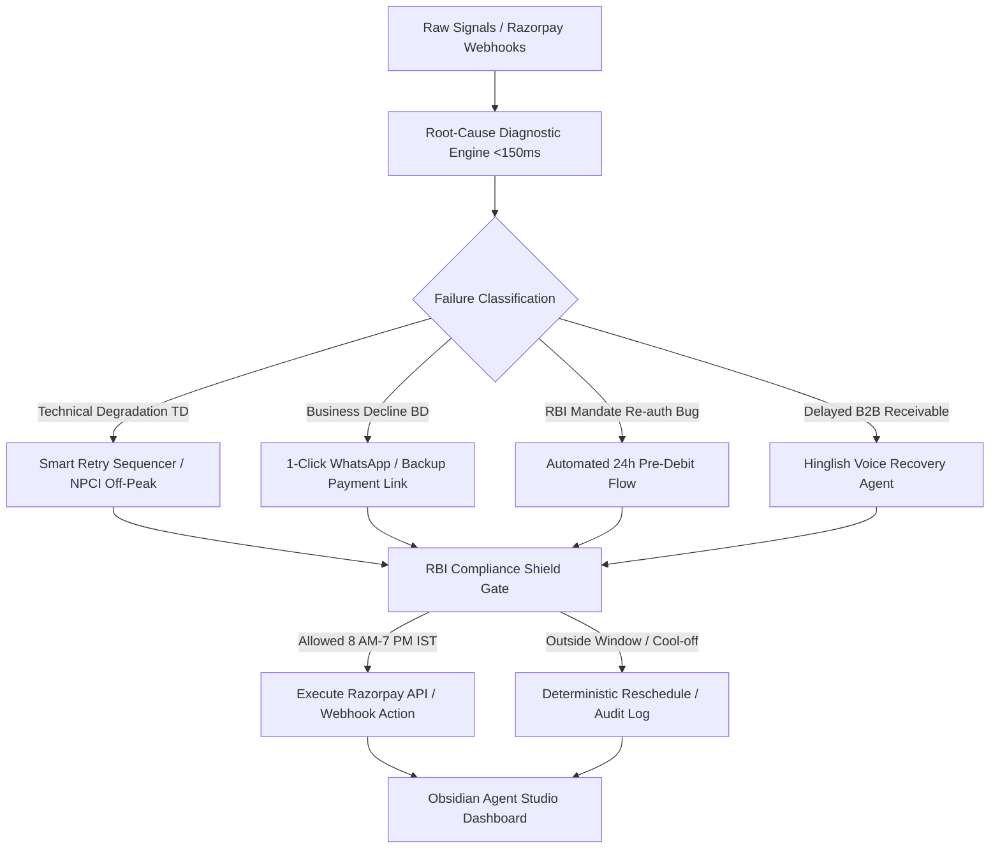

# 🧠 Razorpay Revenue Recovery Brain
### **Track 03 — AI Revenue Recovery | Razorpay AI Buildathon 2026**
*Author: Himanshu | High-Performance Multi-Modal Revenue Recovery Grid*

[](https://fastapi.tiangolo.com)
[](https://reactjs.org)
[](https://vitejs.dev)
[](https://tailwindcss.com)
[](https://www.rbi.org.in)

---

## ⚡ Executive Summary

In Indian digital commerce, revenue does not vanish in a single step—it degrades across **four fragmented funnels**:
1. **Payment Gateway Drop-offs**: NPCI switch outages, bank downtime, card limits.
2. **Checkout Abandonment**: Mobile UPI intent mismatches, price frictions, address drop-offs.
3. **Subscription Churn**: Involuntary cancellations from the RBI >₹15,000 mandate re-auth regulations.
4. **B2B Receivables**: 73-day average DSO (Days Sales Outstanding) among Indian SMEs due to ineffective email notices.

Standard industry solutions build isolated dunning bots that blindly fire repetitive reminders. **Revenue Recovery Brain** is a unified root-cause diagnosis engine and intelligent intervention router that processes failures in **<150ms**, enforces **RBI Fair Practices Code guardrails**, executes **Hinglish conversational voice negotiation**, and provides a live audit trail of every financial action.

---

## 🏛️ System Architecture



---

## 🏛️ Production Architecture & Scalability Roadmap

### 1. Concurrency & Idempotency Architecture: SQLite Ceiling vs. Production Migration
> **Production Engineering Note:** In this reference implementation, idempotency locks and state storage are managed via SQLite in WAL (Write-Ahead Logging) mode with millisecond atomic lease locks. This guarantees 100% zero-dependency local reproducibility and deterministic verification during evaluation.
>
> **Production Migration Path:**
> - **Horizontal Scaling:** When scaling across distributed Uvicorn/FastAPI workers, the SQLite lease mechanism cleanly translates to **PostgreSQL row-level locking (`SELECT ... FOR UPDATE NOWAIT`)** or a **Redis-backed distributed lock (Redlock pattern)** with TTL heartbeat leasing.
> - **Queue Decoupling:** In high-volume production deployments (>10,000 webhooks/sec), incoming events enqueue into **Apache Kafka / AWS SQS**, with worker nodes consuming events through idempotent consumer groups.

---

### 2. Multi-Tenancy & Merchant Isolation
The Revenue Recovery Brain is architectured from the ground up as a multi-tenant platform:
- **Merchant Scoping (`merchant_id`):** Every case, webhook payload, and cryptographic ledger record carries an explicit `merchant_id` (e.g. `mid_rzp_prod_01`), enabling tenant-level data isolation.
- **Dynamic Credential Resolution:** Razorpay API key pairs (`RAZORPAY_KEY_ID`, `RAZORPAY_KEY_SECRET`) and webhook secrets are resolved dynamically per merchant from secure vault storage rather than static global environment variables.
- **Per-Merchant Rate Limits & Autonomy Envelopes:** High-risk or newly onboarded merchants operate with tighter autonomy caps and lower daily spend limits than enterprise merchants.

---

### 3. Digital Personal Data Protection (DPDP) Act 2023 Compliance
As an AI system placing automated voice calls and storing customer payment signals, the platform natively enforces India's **Digital Personal Data Protection Act, 2023 (DPDP Act 2023)**:
- **Purpose Limitation:** Customer transaction data is processed strictly for the stated purpose of invoice settlement and payment rescue.
- **Statutory Retention Schedule:**
  - **Voice Call Audio Recordings:** **30 Days TTL** (audio binaries purged automatically; cryptographic SHA-256 integrity hash preserved).
  - **Conversational Transcripts & PTP Logs:** **90 Days TTL**.
  - **Accounting Proofs & Decision Receipts:** Retained permanently for statutory compliance.
- **Automatic PII Masking:** Real-time redaction of phone numbers (`+91 98765*****`), email addresses (`r***@razorpay.com`), and bank accounts (`**** 5512`).
- **Debtor Right to Erasure (Section 12):** Exposes a statutory erasure endpoint (`POST /api/governance/dpdp/erase-customer`) that purges debtor PII while appending a zero-knowledge cryptographic tombstone to the audit ledger.

---

### 4. Spend Governor & 3 AM Runaway Circuit Breaker
To eliminate the risk of runaway API costs or infinite outreach loops during off-hours:
- **Hard Daily Budget Cap:** Enforces a configurable daily spend limit (e.g. ₹500/day on WhatsApp/telephony API fees) per merchant. Once breached, automated actions halt and queue for human sign-off.
- **Daily Action Ceiling:** Limits maximum automated interventions (e.g. 100 actions/day per merchant).
- **Emergency Platform Kill Switch:** Provides a master hardware/software kill switch (`POST /api/governance/spend-governor/kill-switch`) that instantly suspends all outbound autonomous calls and retries across the platform with a single command.

---

### 5. Third-Party Independently Verifiable Audit Ledger
Unlike black-box logging frameworks, the Revenue Recovery Brain provides **independent cryptographic proof**:
- Every intent, compliance decision, and execution event is chained in a SHA-256 hash sequence (`prev_hash -> content_hash`).
- **Zero-Dependency CLI Verifier:** Evaluators, auditors, and merchants can independently verify mathematical integrity without trusting the backend:
  ```bash
  python backend/verify_ledger.py
  # Or verify an exported ledger against a running instance:
  python backend/verify_ledger.py http://localhost:8000/api/audit-ledger/export
  ```

---

### 6. Observability & Staleness Escalation for Stuck Cases
To prevent cases from silently falling through the cracks when waiting for human approval:
- **Continuous SLA Monitoring:** The `StalenessMonitor` scans in-flight cases against strict SLA thresholds (e.g., 2 hours for cart abandonments, 24 hours for B2B approval queues).
- **Auto-Escalation:** Cases exceeding SLA thresholds are automatically flagged (`is_stale = True`), assigned `HIGH` priority in the supervisor review queue, and logged to the audit ledger.

---

## 🚀 Key Features & Differentiators

| Dimension | Standard Dunning Bots | Revenue Recovery Brain |
|---|---|---|
| **Funnel Scope** | Single leak silo (only cart or only dunning) | **Unified 4-Funnel Intelligence (TD, BD, Mandates, B2B)** |
| **Multi-Tenancy** | Single-merchant script | **Tenant-Scoped (`merchant_id`) with Per-Merchant Vault Keys** |
| **Regulatory Fluency** | Unchecked LLM prompts | **Hard-Coded RBI FPC Principles + Section 43B(h) + DPDP Act 2023** |
| **Spend Safety** | Uncapped API execution | **Daily Spend Governor & Emergency Platform Kill Switch** |
| **Audit Integrity** | Mutable app database rows | **Mathematically Verifiable SHA-256 Cryptographic Chain** |
| **Silent Failures** | Cases sit in limbo indefinitely | **Staleness Monitor with Automatic Supervisor Escalation** |

---

## 🎮 Quick Start & Verification

### Run Complete 21-Test Architectural Verification Suite
```bash
cd backend
.\venv\Scripts\python test_recovery_brain.py
```

### Run Standalone Cryptographic Audit Verifier
```bash
cd backend
.\venv\Scripts\python verify_ledger.py
```

### Run 4-Funnel Cross-Leak Unification Demo
```bash
curl http://localhost:8000/api/demo/unified-recovery-scenario
```

---

## 📜 Regulatory Standards Enforced

1. **Strict RBI Voice Credential Prohibition (Master Direction on Digital Payment Security Controls)**:
   - Voice recovery is **strictly consultative** (negotiating Promise-to-Pay dates and restructuring milestones).
   - In accordance with RBI regulations, asking for OTPs, UPI MPINs, card numbers, or payment credentials over voice/IVR is **architecturally prohibited**.
   - Payments are completed **exclusively by customer self-service** via official Razorpay Payment Links dispatched by SMS/WhatsApp.
2. **Responsible Collections Policy (Inspired by RBI Fair Practices Code Principles)**:
   - Strictly bounded contact window: **8:00 AM – 7:00 PM IST**.
   - Maximum **2 voice calls** / **3 digital nudges** per week per customer.
   - Mandatory **48-hour cool-off period** following a customer dispute or financial hardship.
   - Economic floor stopping rule: interventions below ₹100 are automatically aborted to prevent cost > recovery.
3. **Digital Personal Data Protection Act, 2023 (DPDP Act 2023)**:
   - Purpose limitation, 30-day voice audio retention TTL, real-time PII masking (phone, email, bank account), and statutory Right to Erasure (Section 12) with cryptographic ledger tombstones.
4. **Income Tax Act Section 43B(h) MSME Clock & WACC Time-Value Discounting**:
   - 45-day statutory tax deferral countdown engine for B2B receivable settlements.
   - Counterfactual ENRV incorporates working capital cost of debt ($r = 18\%$ p.a. WACC benchmark for Indian SMEs) and relationship tenure churn discounting.
5. **RBI Circular on Processing of e-Mandates (DPSS.CO.PD.No.447/02.14.003/2021-22)**:
   - Mandatory 24-hour pre-debit notifications and explicit Additional Factor Authentication (AFA) push flows for recurring charges exceeding ₹15,000.

---

Built for **Razorpay AI Buildathon 2026 · Track 03: AI Revenue Recovery**.
